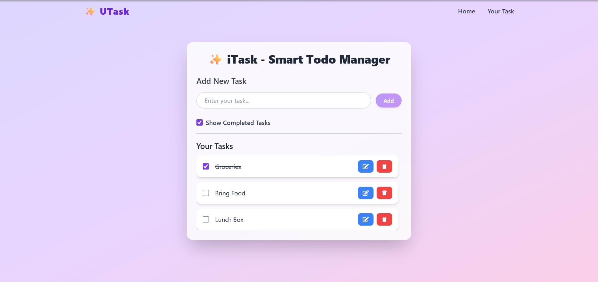

# ✅ Todo App

A modern and responsive **Todo List Application** built using **React.js**, **Tailwind CSS**, and **Vite**.  
This project helps users manage their daily tasks in a simple and efficient way with features like adding, editing, deleting, and marking tasks as completed.

## 🌐 Live Demo

[View Live Project](https://todo-app-tawny-kappa-95.vercel.app/)

---

## 📌 Project Overview

This Todo App is designed to help users keep track of their daily work in one place. It provides a clean and user-friendly interface where tasks can be added, updated, deleted, and stored in the browser using **Local Storage**.

The main goal of this project was to practice and demonstrate:
- React fundamentals
- State management using hooks
- Working with browser local storage
- Building responsive UI using Tailwind CSS
- Deploying a frontend project online using Vercel

This project follows a real-world development flow:
**Build → Design → Debug → Deploy**

---

## ✨ Features

- Add new todos
- Edit existing todos
- Delete todos
- Mark tasks as completed
- Show / hide completed tasks
- Data stored in browser using Local Storage
- Responsive and modern user interface
- Fixed professional navbar
- Deployed live on Vercel

---

## 🛠️ Tech Stack

- **React.js**
- **Tailwind CSS**
- **Vite**
- **JavaScript**
- **React Icons**
- **UUID**
- **Vercel** for deployment

---

## 📷 Project Screenshots

### Home Page


### Add Todo Section


### Todo List View


### Completed Task Example


### Responsive / Mobile View


---

## 🚀 How It Works

### 1. Add a Task
Users can type a task into the input box and click the **Save** button to add it.

### 2. Edit a Task
Users can click the edit icon to update an existing task.

### 3. Delete a Task
Users can remove any task using the delete button.

### 4. Mark as Completed
Each task has a checkbox. When checked, the task is marked as completed and displayed with a line-through effect.

### 5. Show Finished Tasks
Users can show or hide completed tasks using the provided checkbox.

### 6. Persistent Storage
Tasks are saved in **Local Storage**, so they remain even after refreshing the page.

---

## 📂 Folder Structure

```bash
TodoApp/
│
├── public/
├── src/
│   ├── components/
│   │   └── Navbar.jsx
│   ├── App.jsx
│   ├── main.jsx
│   └── index.css
│
├── index.html
├── package.json
├── package-lock.json
├── vite.config.js
├── tailwind.config.js
├── postcss.config.js
└── README.md
